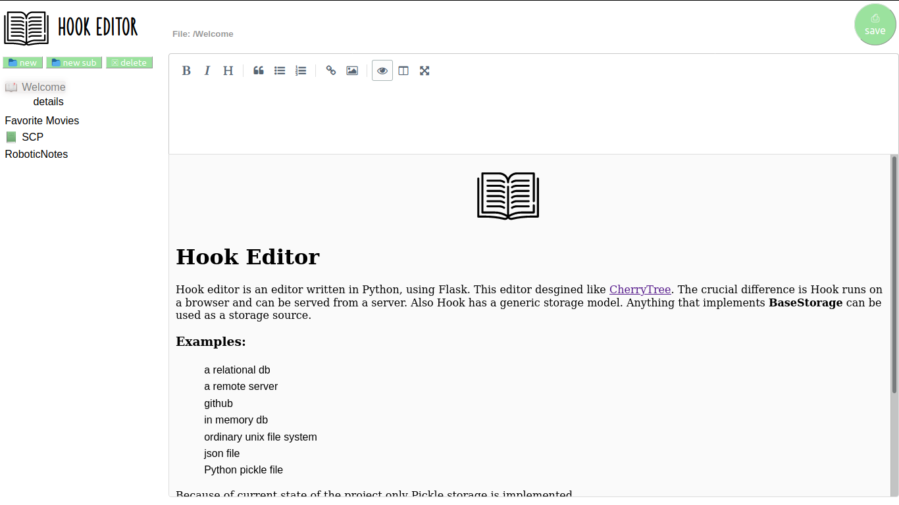

# Hook Editor
Hook editor is an editor written in Python, using Flask. This editor desgined like [CherryTree](https://github.com/giuspen/cherrytree). The crucial difference is Hook runs on browser and can be served from a server. Also Hook has a generic storage model. Anything that implements **BaseStorage** can be used as a storage source. 

### Examples: 
* a relational db
* a remote server
* github
* in memory db
* ordinary unix file system
* json file
* Python pickle file

Because of current state of the project only Pickle storage is implemented. 

`Press the *eye* icon to see the preview.`

# Warning! On Windows there might be file problems.
# I only tried this in Ubuntu

Note: because of a cdn internet connection is required.
This problem can be solved by installing the package.
But for now I just use cdn

## Screen Shots 

## Installing

`python3 install -r requirements.txt`
`python3 src/api.py`

Then go into `http://localhost:5000/index`
